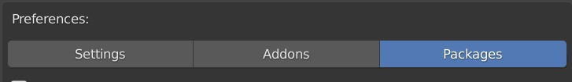
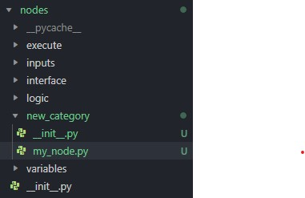

# Introduction

The addon allows you to create packages of nodes that can be installed by the user. You are free to develop these packages and share or sell them.

If you develop a package, please let us know so we can promote it. There is also a built in marketplace which we can update over the air. This allows users to look for packages directly in the addon and not have to scout the internet to find them. Please reach out to us via **[discord](https://discord.gg/NK6kyae)** when you have a package for us to share.



## What you will do

Your package contains custom nodes which can then be used to generate addons. The basic idea of a node tree is, that when the node tree is compiled, the first node gets evaluated and returns a dictionary with the generated code. This code can then contain sockets of other nodes which, again, will get evaluated and return code themselves. This process is repeated until there is only code left.


## More info

A node can look however you want. You can write custom operators that allow you to select UI elements or have lists, enums, checkboxes, ... You can put anything on a node that you want, you just need to make sure a correctly structured dictionary is returned.

You also should not add custom socket types. The addon is doing things like generating sockets dynamically, checking for errors and things like that which require specific treatment for each socket type. If you feel like a socket type is missing, please let us know.

You should make sure that your nodes have icons that make sense, have visually pleasing colors and follow a consistent naming scheme. You might want to consider to add a prefix in front of your nodes names to show that they belong together.


## Development

The basic structure which you will develop is the following:

You will distribute a *.zip* file to others which can then be installed in the addons user preferences.

Your zip file can hold multiple folders. These folders are where the *.py* files for the nodes go. Each python file equals to one node. The folders correspond to the node categories. These are the lists that show up in the Node Add menu.

**Example:**

If you want to create a node in the _Interface_ category, you'd add a folder called Interface and a python file inside that folder. This is where the code for your node goes.

If you create a folder with a name that doesn't exist yet, that category will be created. You can _not_ nest folders to create subcategories!

Finally you will need a _package_info.json_ file which also goes in the zip file. This holds information on your package. This will be explained in more detail as well.

An example for the structure of your package zip file could look as follows:

```python
.
├── package_info.json
├── Interface
│   └── new_node.py
├── New Category
│   ├── my_node.py
│   └── my_other_node.py
```


## Get Started
To actually get started developing we have a few recommendations. To work on a node you want to add to your package, you need to add it to temporarily add it to the addon itself.

Start by finding the folder where you have installed the visual scripting addon. You can find this in the user preferences in the addons panel under _File_.

In this folder you'll find a folder called nodes. This is the folder you'll work in. When you open up the folder you will find the directories corresponding to the node categories, as mentioned in the introduction. These are the installed categories and nodes. When a user installs your package, the zip files content will go in here. You don't need to and can't touch any of the other files in any of the addons folders. You only create your nodes in the corresponding folder for development and then put them in the zip file for distribution.

To create a new category during development, you create a subfolder in _nodes_ with the corresponding name. Now you need to add a file called \_\_init\_\_.py in that folder. This is for blender to recognize it as a part of the addon, but can be left empty. Note that you **do not** need to add this file in your final zip. This will be done automatically if necessary.



Your new category should then look something like this. If you just want to add a node in an existing category you only need to add your .py file for the node itself in the existing folder. You can have new categories and existing ones in one package. Note that empty categories will not be shown, meaning you need to create a node first for it to show up.


## Conclusion

You should now know how to set up your editor for developing your package. Start by creating a file for a node in a new or existing category. We will now continue with developing a node. Later we will get into how to distribute your package in the mentioned zip file once you are done with development.