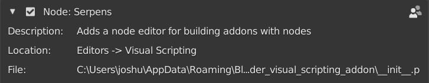
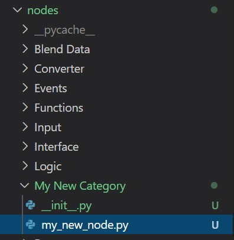

# Setup

## Development Setup
To actually get started developing we have a few recommendations. To work on a node you want to add to your package, you'll need to temporarily add it to the addon itself.

Start by finding the folder where you have installed the visual scripting addon. You can find this in the user preferences in the addons panel under _File_.

Inside the main Serpens folder you'll find a folder called nodes. This is the folder you'll work in. When you open up the folder you will find the directories corresponding to the node categories, as mentioned in the introduction. These are the installed categories and nodes. When a user installs your package, the zip files content will go in here. You don't need to and can't touch any of the other files in any of the addons folders. You only create your nodes in the corresponding folder for development and then put them in the zip file for distribution.

To create a new category during development, you create a subfolder in _nodes_ with the corresponding name. Now you need to add a file called \_\_init\_\_.py in that folder. This is for blender to recognize it as a part of the addon, which can be left empty. Note that you **need** to add this file in your final .zip if you are creating a new category. If you only add nodes to an existing category don't add the file.

Your new category should then look something like in the image above. If you just want to add a node in an existing category you only need to add your .py file for the node itself in the existing folder. You can have new categories and add nodes to existing ones in one package. Note that empty categories will not be shown, meaning you need to create a node first for it to show up in blenders add menu.

## Summary

You should now know how to set up your editor of choice for developing your package. We use VS Code together with Jacques Lucke's [Blender Development extension](https://marketplace.visualstudio.com/items?itemName=JacquesLucke.blender-development). Start by creating a file for a node in a new or existing category. We will now continue with developing a node. Later we will get into how to distribute your package in the mentioned zip file once you are done with development.